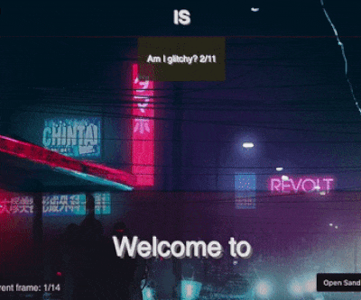

# react-use-presentation

> Create pure HTML (React enriched if you will) presentations.

[](https://www.npmjs.com/package/react-use-presentation)

[Preview here!](https://codesandbox.io/s/react-use-presentation-1c2du)

[Preview with background video here!](https://codesandbox.io/s/react-use-presentation-with-bg-d7f7j)

---

## Table of Contents

- [Running example](#running-example)
- [Install](#install)
- [Usage](#usage)
- [Documentation](#documentation)
- [License](#license)

---

## Running example

| Plain                           | Video BG                           |
| ------------------------------- | ---------------------------------- |
|  |  |

---

## Install

```bash
npm install --save react-use-presentation
```

---

## Usage

- Set up your presentation array with each object acting as a movie frame. See the example and contract below:

```tsx
const myFramesArray = [
  {
    component: <div>First Frame with 1 second duration</div>,
    time: 1000
  },
  {
    component: <div>Second Frame with 2 second duration</div>,
    time: 2000
  },
  {
    component: <div>Last Frame without duration</div>,
  }
]
```

- To initialize a Presentation component:

```tsx
import * as react from 'react';
import usePresentation from 'react-use-presentation';

export default function App() {
  const Presentation = usePresentation({ framesOptions: myFramesArray1 });

  return (
    <Presentation />
  )
}
```

- To initialize a __delayed__ (in milliseconds) Presentation component:

```tsx
import * as react from 'react';
import usePresentation from 'react-use-presentation';

export default function App() {
  const DelayedPresentation = usePresentation({ framesOptions: myFramesArray2, startDelay: 1000 });

  return (
    <DelayedPresentation />
  )
}
```

- To initialize a __delayed__ (in milliseconds) and also in __loop__ Presentation component:

```tsx
import * as react from 'react';
import usePresentation from 'react-use-presentation';

export default function App() {
  const DelayedAndLoopedPresentation = usePresentation({ framesOptions: myFramesArray3, startDelay: 1000, isLoop: true });

  return (
    <DelayedAndLoopedPresentation />
  )
}
```

- To initialize multiple separated presentations:

```tsx
import * as react from 'react';
import usePresentation from 'react-use-presentation';

export default function App() {
  const Presentation = usePresentation({ framesOptions: myFramesArray1 });
  const DelayedPresentation = usePresentation({ framesOptions: myFramesArray2, startDelay: 1000 });
  const DelayedAndLoopedPresentation = usePresentation({ framesOptions: myFramesArray3, startDelay: 1000, isLoop: true });

  return (
    <DelayedAndLoopedPresentation />
  )
}
```

---

## Documentation

`usePresentation()` constructor:

```tsx
type TFrameOptions = {
  component: Component | null,
  time?: number
}

type TUsePresentation = {
  framesOptions: Array<TFrameOptions>,
  startDelay?: number,
  isLoop?: boolean
}

usePresentation(TUsePresentation);
```

`usePresentation()` returns:

- *Presentation*: Component<{}, {}, any> | null

> The *Presentation* component name is purely arbitrary i.e. *MyLittleComponentPresentation* will do just fine.

---

## License

react-use-presentation is [MIT licensed](./LICENSE).

---

This hook is created using [create-react-hook](https://github.com/hermanya/create-react-hook).
